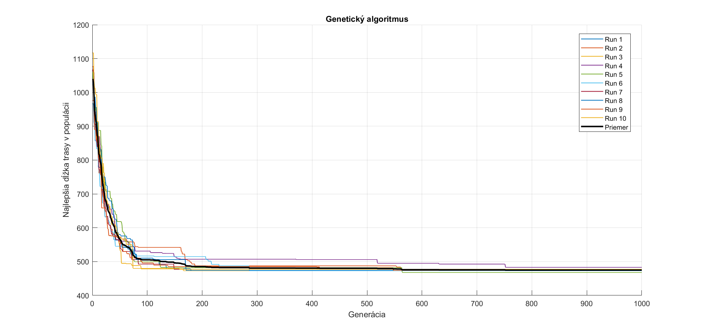
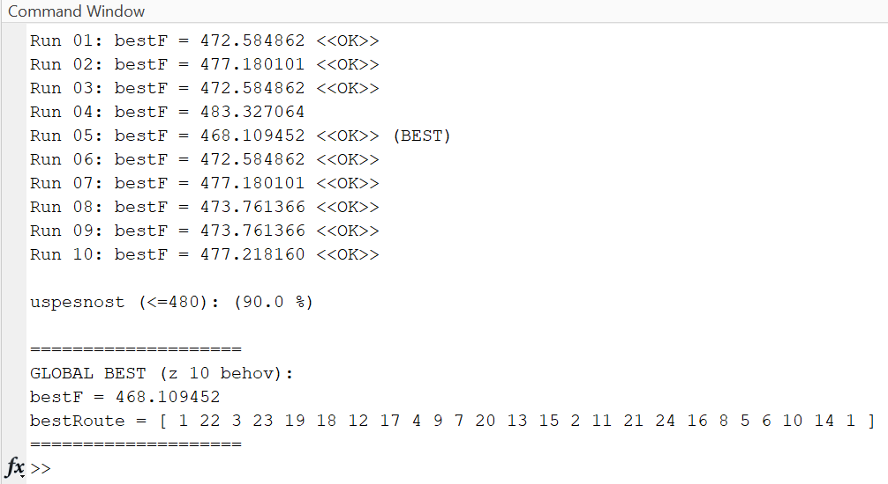

# Travelling Salesman Problem – genetický algoritmus
Vyuzil som geneticky algoritmus na riesenie klasickenho optimalizačného problému **TSP (Travelling Salesman Problem)** – nájsť najkratšiu trasu, ktorá prejde všetkými bodmi.
Algoritmus simuluje evolúciu: populácia trás sa postupne zlepšuje pomocou selekcie, kríženia a mutácie. Program spustí **10 nezávislých behov** a porovná ich výsledky.
## Konvergencia algoritmu

## Ukážka výpisu programu

